# Random Forest Land Classification

# 1. Overview

Using ESA SNAP toolbox together with Sklearn and Jupyter notebook to perform land
classification over Finland. Random Forest algorithm with 20 trees has been utilized to perform the land classification. 

# 2. Sentinel-1A Product

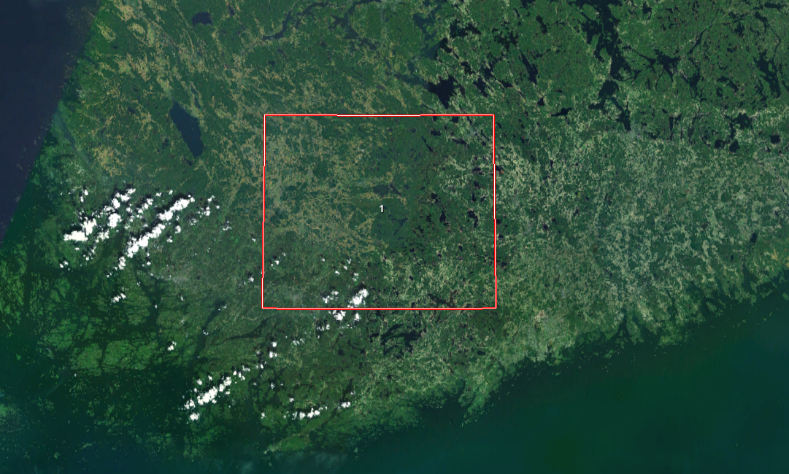 
_Study area_

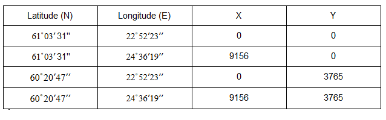   

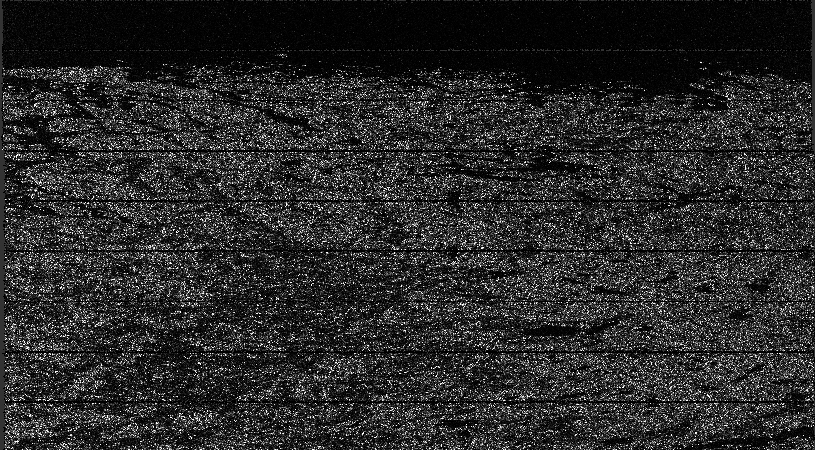    
_S1A IW2 band before processing_

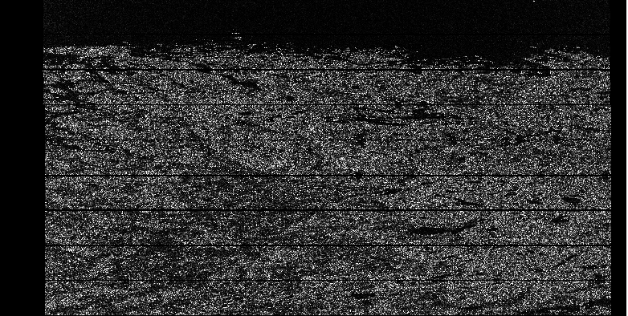   
_S1A product after radiometric calibration_

  
_S1A VH band after TOPS deburst

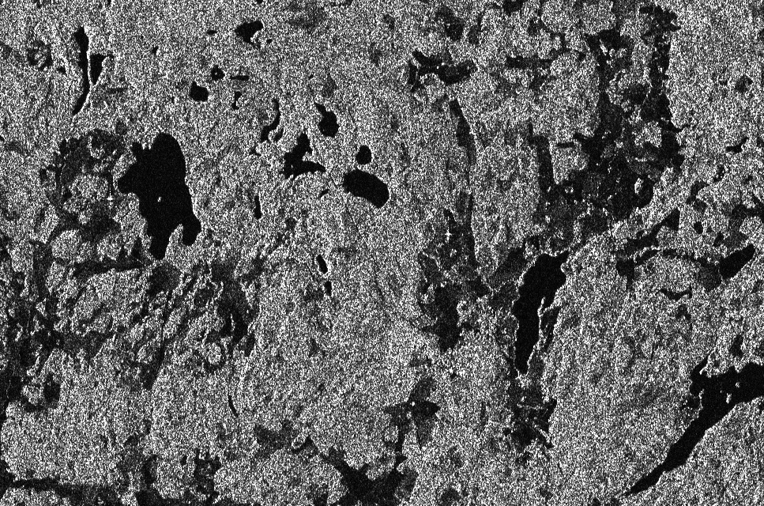
_S1A after multilooking_

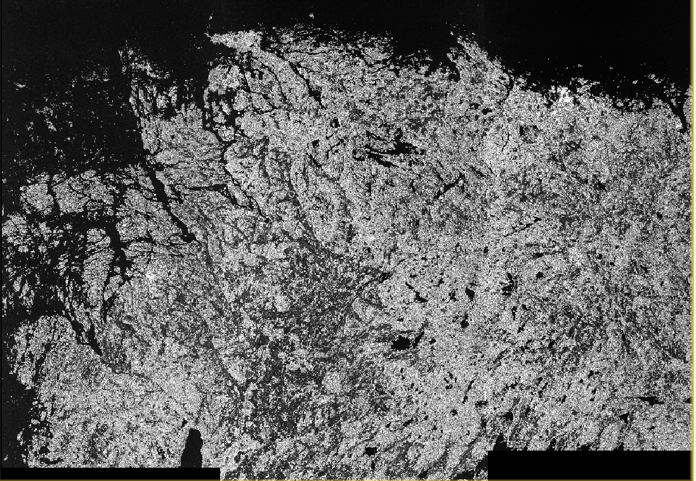              
_S1A after speckle filtering using Refined Lee filter_

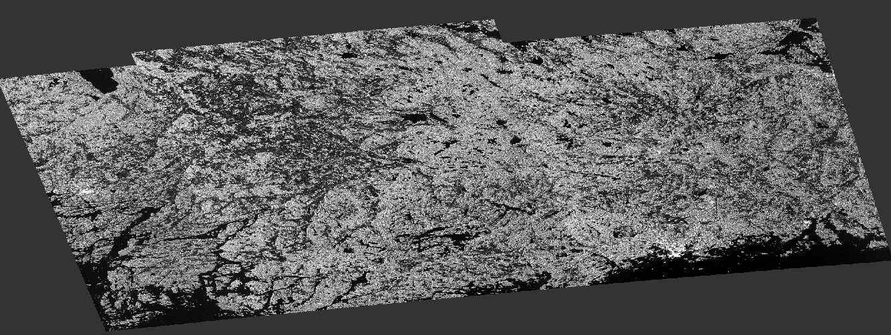
_Sentinel-1A product after terrain correction_

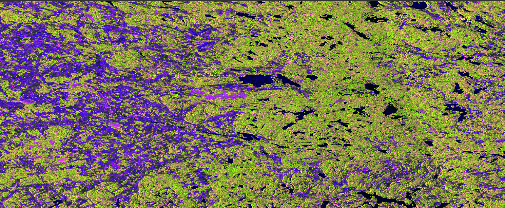
_S1A RGB product_

# 3. Sentinel-2B product
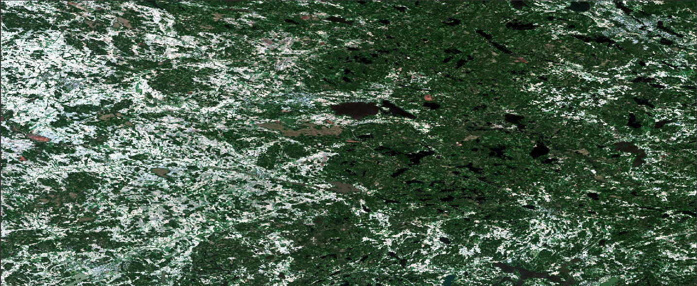
_S2B RGB product with B4 as red, B3 as green and B2 as blue_

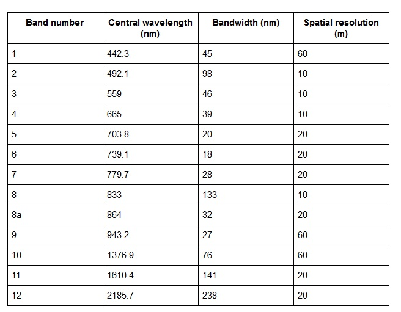                         
_S2B bands_

# 4. Sentinel-1A and Sentinel-2B RGB Mix

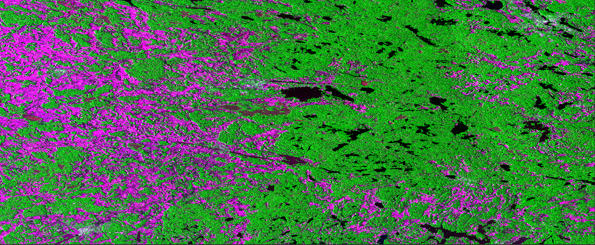
_S2 B4 as red, S1 VH as green, S2 B2 as blue_

# 5. Corine2012 Product
Corine2012 product has been resampled from 100 m resolution to 20 m resolution to match
Sentinel-1 product and Sentinel-2 product resolution. 

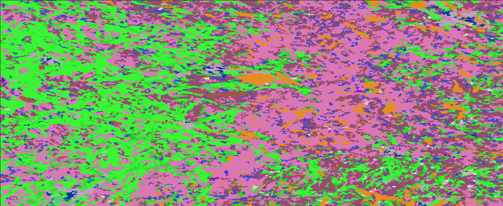
_Corine2012 product of the study area_

During Python processing Corine land classes have been converted to five major classes:
* Artificial surfaces
* Agricultural areas
* Forest and semirural areas
* Wetlands
* Water bodies

# 6. Collocation of Products

The collocated data has been converted into three separate CSV formatted data sets to be run on the random forest algorithm. Each CSV products has a total of 21,855,475 rows. Sentinel-1 product has three attributes as columns, red color, green color and blue color. Sentinel-2 product has 13 attributes in total corresponding to all of the Sentinel-2 bands. Sentinel-1 and Sentinel-2 RGB product has three attributes and Sentinel-1 VV+VH has two attributes.

# 7. Results

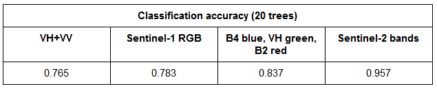       
_Land class prediction accuracy results on test data with 20 trees_

## 7.1 Band Importances For Making Prediction

For Sentinel-1 RGB product land classification green color attribute is the most important for correct prediction followed by
red color attribute and blue color attribute being the least important. 

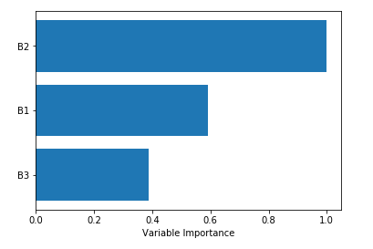                
_Sentinel-1 RGB attributes relative importance for correctly predicting land class.
B1 = red, B2 = green, B3 = blue_

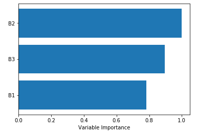                      
_S1 and S2 RGB product attribute importances,
in figure B1 = sentinel-2 B4, B2 = Sentinel-1 VH, B3 = Sentinel-2 B2_

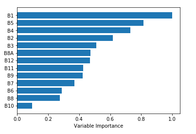      
_Sentinel-2 bands relative importance for correctly predicting land class_

## 7.2 Confusion Matrices

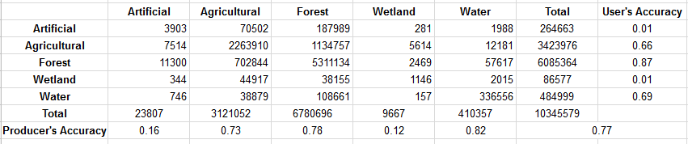      
_Sentinel-1 VV and VH sigma0 confusion matrix_

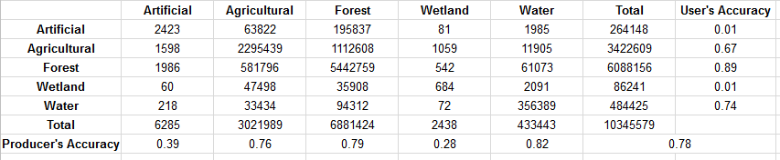      
_Sentinel-1 RGB dual pol ratio sigma0 VV+VH confusion matrix_

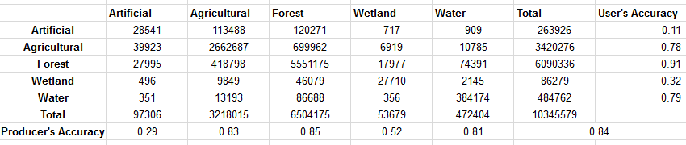      
_Sentinel-1 and Sentinel-2 RGB mix confusion matrix_

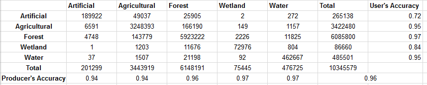      
_Sentinel-2 confusion matrix_
