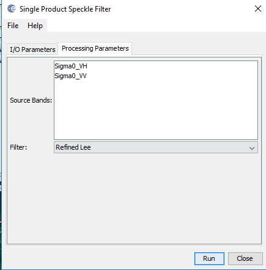

# Random Forest Land Classification

# 1. Overview

Using ESA SNAP toolbox together with Sklearn and Jupyter notebook to perform land
classification over Finland using Random Forest algorithm. 

# 2. Sentinel-1A Product

 
_Study area_

   

    
_S1A IW2 band before processing_

   
_S1A product after radiometric calibration_

  
_S1A VH band after TOPS deburst

_S1A after speckle filtering_

          
_Speckle filtering settings_

_S1A after multilooking_

_S1A RGB product_

# 3. Sentinel-2B product

_S2B RGB product with B4 as red, B3 as green and B2 as blue_

_S2B bands_

# 4. Sentinel-1A and Sentinel-2B RGB Mix

_S2 B4 as red, S1 VH as green, S2 B2 as blue_
