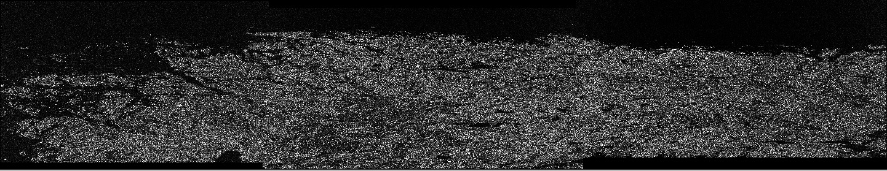

# Random Forest Land Classification

 
_Study area_

   

    
_S1A IW2 band before processing_

   
_S1A product after radiometric calibration_

  
_S1A VH band after TOPS deburst

_S1A after speckle filtering_

_Speckle filtering settings_

_S1A after multilooking_

_S1A RGB product_

_S2B RGB product with B4 as red, B3 as green and B2 as blue_

_S2B bands_

